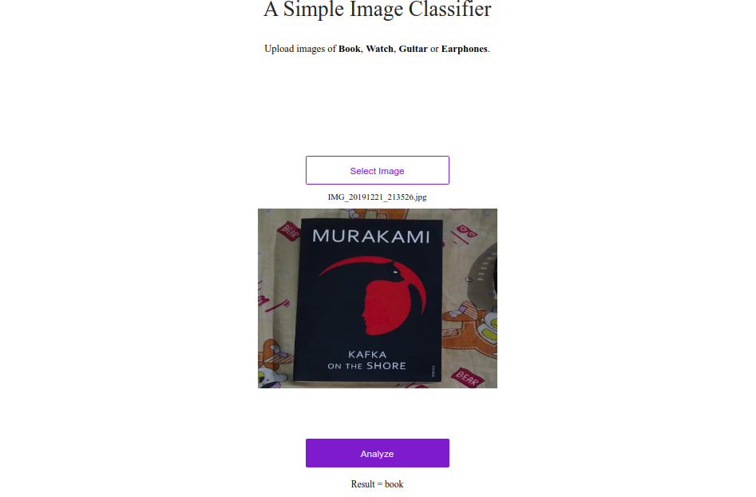

# Custom Image Classifier

This repository contains to code train your own custom image classifier using Google Colab. And the code to run the deep learning model in a web-app.

I have posted a tutorial guide on my blog and in medium platform also to train your own model. Here's the link:

- [Medium](https://medium.com/@thecaffeinedev/how-to-create-your-own-custom-image-classifier-and-deploy-it-to-production-5506bb26a74b)

Below are some image inference results you can see :

You can check more results files in results folder.

If you have any questions, recommendations or critiques, I can be reached via [Twitter](https://twitter.com/thecaffeinedev) or via my [mail](mailto:prabhat1015@gmail.com). Feel free to reach out to me.
